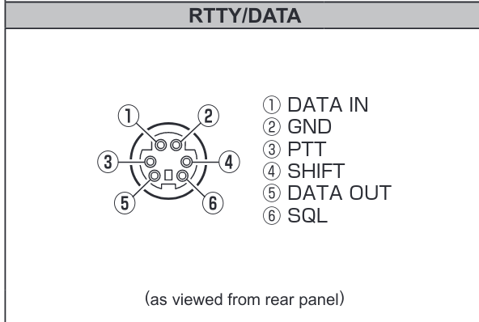

# Operation
I'll be sending voice audio from my USB mic, through my computer, out to the radio via the USB audio device. I'll need something to trigger PTT (via the RTTY/DATA port).

Idea stolen from KF4LES: PTT button, but with a cut-off switch so that you don't accidentally bump the button and transmit.

To use:
1. Flip SW1 to on
2. Press momentary SW2 to trigger PTT

How it works:
1. SW1 turns on one relay and provides 13.8V to SW2's lamp
3. Relay "Btn Ctrl" connects in series with momemtary SW2, enabling its use for connecting Radio's PTT to Ground

# Schematic
SW2 definitely needs 12V
SW1 works with both 5 and 12V, light turns on when switch is on

RTTY/DATA port pinout, takes a 6-pin mini-DIN plug

# TODO
- [x] is the lamp in SW1 a lamp, or LED? Does it need a resistor?
- [x] Do the lamps in SW1 and SW2 use 12V? Or does this need a voltage regulator to drop it to 5V?
